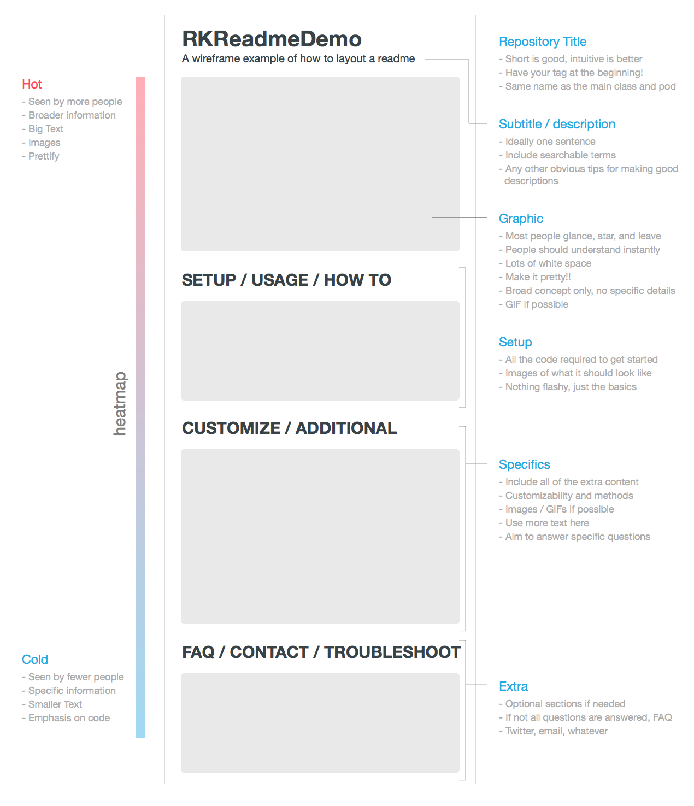

# Tips and tools to write your readme file

## Tools

Github flavored markdown currently miss an important feature, the automatic
creation of the *table of contents*. Here some tools you can use to
automatically generate it:

- [github-markdown-toc](https://github.com/ekalinin/github-markdown-toc);

If you want to enhance your markdown file with some automatically generate
stuff, this is the tool for you. You can automatically insert code from a file
or URL, insert any data inside your markdow or generate the table of contents.

- [markdown-magic](https://github.com/DavidWells/markdown-magic);

## References

- A [template](https://gist.github.com/fvcproductions/1bfc2d4aecb01a834b46) by
  fvcproductions;

## Examples
> Some examples of nice readme files.

- [nerd-fonts](https://github.com/ryanoasis/nerd-fonts/blob/master/readme.md)
