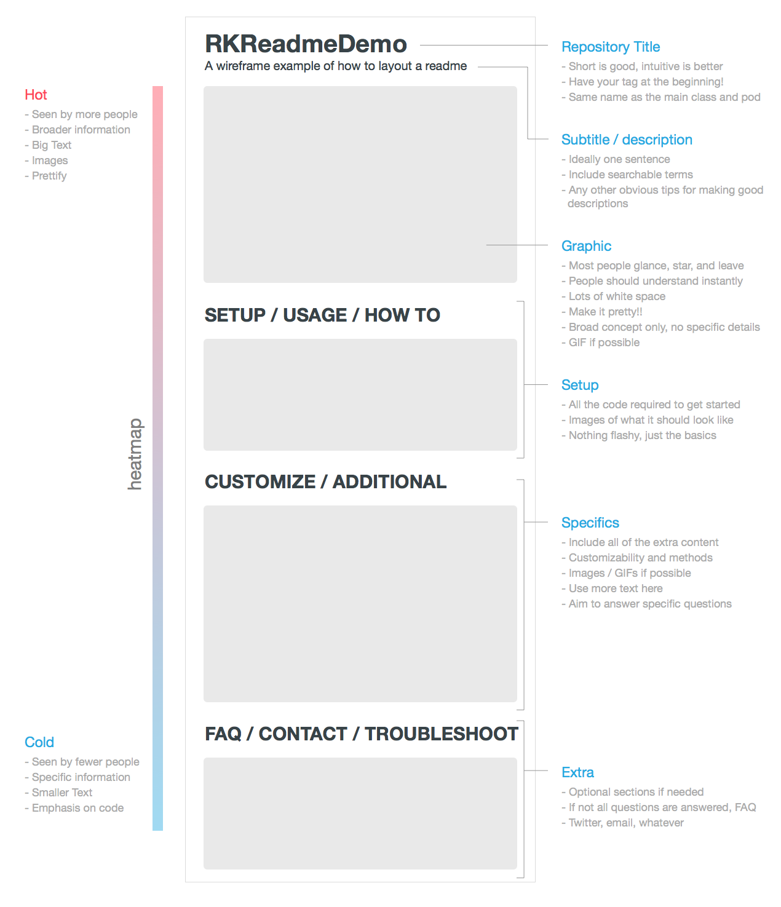

# Tips and tools to write your readme file

> [Reference](https://help.github.com/articles/about-readmes/)
> [Reference](https://medium.freecodecamp.org/how-to-get-up-to-3500-github-stars-in-one-week-339102b62a8f)

- **Badges** are a nice way to quickly show the status of your project: build
  status, issues, coverege, license, and others;

- Some nice **Graphics** is essential to rapidly communicate to the user what your project is about;

- A **Table of contents** is necessary if your readme file is long;

## Tools

Github flavored markdown currently miss an important feature, the automatic
creation of the *table of contents*. Here some tools you can use to
automatically generate it:

- [github-markdown-toc](https://github.com/ekalinin/github-markdown-toc);

If you want to enhance your markdown file with some automatically generate
stuff, this is the tool for you. You can automatically insert code from a file
or URL, insert any data inside your markdow or generate the table of contents.

- [markdown-magic](https://github.com/DavidWells/markdown-magic);

Sometimes is useful to show how to use your project through some videos or
gifs. Here some tools to help you with that:

- [ttystudio](https://github.com/chjj/ttystudio);

Badges are a nice way to quickly communicate to the user the status of your
project. Here some tools you might find useful:

- [badgerbadgerbadger](https://github.com/badges/badgerbadgerbadger);
- [License badges](https://gist.github.com/lukas-h/2a5d00690736b4c3a7ba);

## Examples
> Some examples of nice readme files.

- [nerd-fonts](https://github.com/ryanoasis/nerd-fonts/blob/master/readme.md)

## References

- [template](https://gist.github.com/fvcproductions/1bfc2d4aecb01a834b46) by
  fvcproductions;

