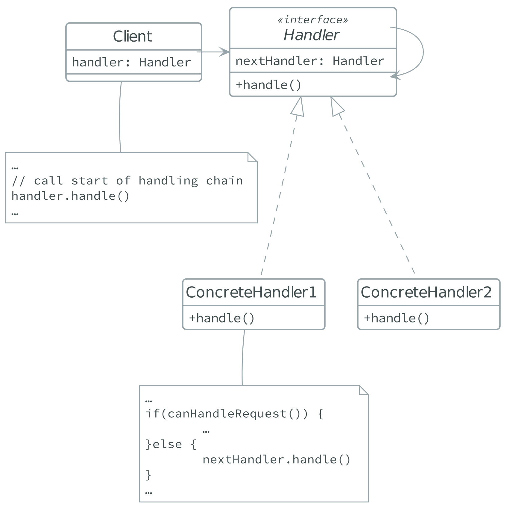

# Behavioral Patterns

## Chain of responsibility
> [Reference]()

- The *Chain of responsibility pattern avoids coupling the sender of a request
  to its receiver;

- The **sender** doesn't know who is going to handle a request, the request has
  an **implicit receiver**;

- The **receivers** are chained together and they pass the request along the
  chain until an object handles it;

### Structure and code

- [Kotlin example code](./.code/chain_of_responsibility.kts);

- [Kotlin example code](./.code/chain_of_responsibility_error_handling.kts);

## Command

> [Reference]()

- The *Command* pattern encapsulates a request as an object;

- The **request** object encapsulates all information needed to perform an
  action, this includes the method name, the method parameters and the
  **receiver** object;

- This pattern can be extended to support the queueing and the logging of
  multiple requests, together with undoable operations;

## Interpreter
## Iterator
## Mediator
## Memento
## Observer
## State

## Strategy

> [Reference](https://sourcemaking.com/design_patterns/strategy)

- The *Strategy* pattern gives you the ability to define a family of algorithms,
encapsulate each one, and make them interchangeable.

- *Strategy* reduces the *coupling* between the clients and the algorithms. The
algorithm can vary independently from the clients that use it.

- The pattern capture the abstraction in an interface, and bury the
  implementation details in derived classes.

### Structure and code

## Template method
## Visitor
